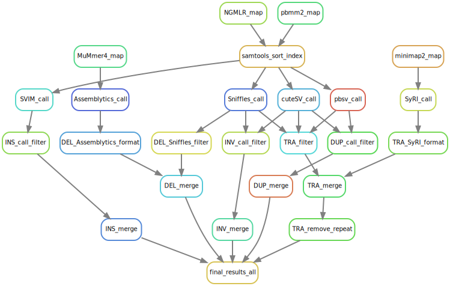
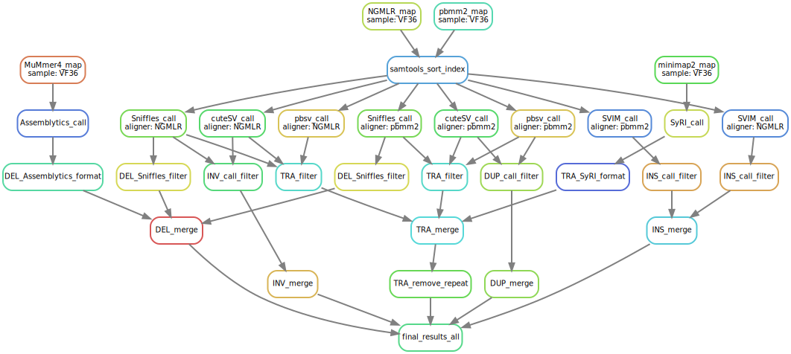

HiFi-sv-snakemake
=================
A [snakemake](https://snakemake.readthedocs.io/en/stable/) pipeline for structural variant(SV) analysis base on HiFi reads <br>
With it, you can get a set of SV dataset including five types, which are `Insertion`, `Deletion`, `Inversion`, `Duplication`, and `Translocation`.

- [Input files](#input-files)
- [Dependencies](#Dependences)
- [Examples](#examples)
- [Overview of the workflow](#overview-of-the-workflow)

## Input files
To use the pipeline you should first copy the `Snakefile` and `config.yaml` files in the working directory. 
Then prepare the following files:
1. a reference file named `{genome}.fa`
2. a assembled genome file named `{sample}.fa`
3. a HiFi reads fastq file named `{sample}.fq.gz`

The {genome} and {sample} labels should match the label in the configuration (config.yaml file or in the command line).

## Dependencies
- [NGMLR](https://github.com/philres/ngmlr)
- [pbmm2](https://github.com/PacificBiosciences/pbmm2)
- [minimap2](https://github.com/lh3/minimap2)
- [mummer4](https://github.com/mummer4/mummer)
- [samtools](https://github.com/samtools/samtools)
- [pbsv](https://github.com/PacificBiosciences/pbsv)
- [SVIM](https://github.com/eldariont/svim)
- [Sniffles](https://github.com/fritzsedlazeck/Sniffles)
- [cuteSV](https://github.com/tjiangHIT/cuteSV)
- [Assemblytics](https://github.com/MariaNattestad/Assemblytics)
- [SyRI](https://github.com/schneebergerlab/syri)
- [bcftools](https://github.com/samtools/bcftools)
- [survivor](https://github.com/fritzsedlazeck/SURVIVOR)

Conda environment files containing the dependencies can be found in the `envs` directory. These can be automatically installed and managed by providing the `--use-conda` argument to snakemake: `snakemake --use-conda ...`.<br>
The folder `scripts` contains python scripts and text necessary for the pipeline.

## Examples
This pipeline mainly contains four steps:
1. *read_map_all* to obtain all necessary ailgnment file for SV calling.
```
snakemake --configfile config.yaml --cores 32 --use-conda read_map_all
```
2. *call_original_all* to calling SV by mutiple callers and aligners.
```
snakemake --configfile config.yaml --cores 16 --use-conda call_original_all
```
3. *call_filter_all* to filter all SV detasets.
```
snakemake --configfile config.yaml --cores 5 --use-conda call_filter_all
```
4. *final_results_all* to get variant suitable for each SV type.
```
snakemake --configfile config.yaml --cores 16 --use-conda final_results_all
```
In this pipeline, we defined:<br>
    Insertion: detected by `NGMLR`+`pbmm2`-`SVIM`;<br>
    Deletion: detected by `NGMLR`+`pbmm2`-`Sniffles` and `Assemblytics`;<br>
    Inversion: detected by `NGMLR`-`cuteSV`+`Sniffles`;<br>
    Duplication: detected by `pbmm2`-`pbsv`+`cuteSV`;<br>
    Tranlocation: detedcted by `NGMLR`+`pbmm2`-`pbsv`+`Sniffles`+`cuteSV` and `SyRI`.

## Overview of the workflow
We can easily visualize the workflow with [Snakemake](https://snakemake.readthedocs.io/en/stable/index.html).

### Rule graph
```
snakemake --rulegraph --configfile config.yaml -f final_results_all | dot -Tsvg > rulegraph.svg
```


### DAG of jobs
```
snakemake -np -f final_results_all --configfile config.yaml --dag | dot -Tsvg > DAGgraph.svg
```

